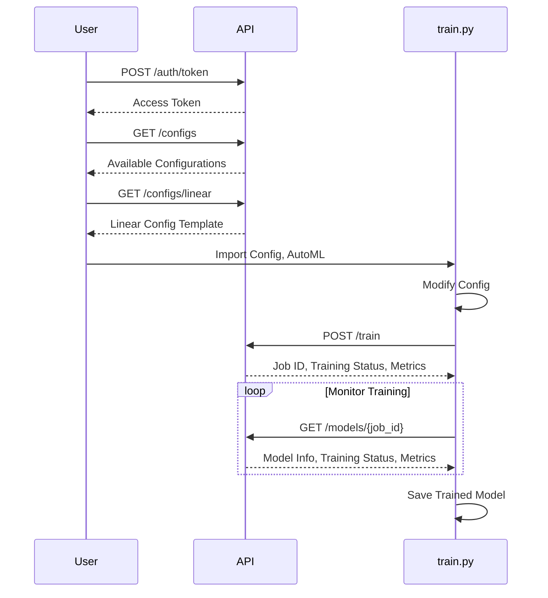

# AutoML Pipeline API Documentation

## Introduction
The AutoML Pipeline API provides a convenient way
to train and manage machine learning models without the need for extensive setup and configuration.
This API allows users to leverage pre-defined configuration templates and focus on their specific use cases,
while the API handles the underlying model training and deployment.

## Base URL
```
https://api.automl.dev/v1
```

## Authentication
To use the API, you'll need to get an API key.
You can generate an API key by sending a POST request to the `/auth/token` endpoint with your username and password:

```bash
curl -X POST -H "Content-Type: application/json" \
     -d '{"username": "your_username", "password": "your_password"}' \
     https://api.automl.dev/v1/auth/token
```

The response will contain your API key,
which you'll need to include in the `Authorization` header for all later API requests:

```bash
curl -H "Authorization: Bearer <YOUR_API_KEY>" \
     -X POST https://api.automl.dev/v1/train
```

## Endpoints

### Training
To start the training process, send a POST request to the `/train` endpoint with your desired configuration:

```
POST /train
```

Request Body:
```json
{
    "config": {
        "model": {
            "type": "classification",
            "input_dim": 10
        },
        "data": {
            "train_path": "s3://bucket/train.csv",
            "val_path": "s3://bucket/val.csv"
        }
    }
}
```

The API will start the training process and return a job ID, current status, and any available metrics.

### Configurations
You can retrieve the list of available configuration templates using the `/configs` endpoint:

```
GET /configs
```

Response:
```json
{
    "configs": [
        "classification",
        "regression",
        "vision"
    ]
}
```
This allows you to see the pre-defined configuration options that you can use for your training tasks.

### Models
Once the training is complete,
you can retrieve information about the trained model using the `/models/{model_id}` endpoint:

```
GET /models/{model_id}
```

Response:
```json
{
    "model_id": "m123",
    "status": "training",
    "metrics": {
        "train_loss": 1.6422,
        "val_loss": 1.6169
    }
}
```
This endpoint allows you to check the status of your training job,
as well as view the performance metrics for the trained model.

## Using the API
Here's an example of how you can use the AutoML Pipeline API in a Python client:

```python
import requests

class AutoMLClient:
    def __init__(self, api_key):
        self.api_key = api_key
        self.base_url = "https://api.automl.dev/v1"

    def train(self, config):
        response = requests.post(
            f"{self.base_url}/train",
            json={"config": config},
            headers={"Authorization": f"Bearer {self.api_key}"}
        )
        return response.json()
```



In this example, the `AutoMLClient` class provides a simple interface to interact with the API.
The `train` method sends a POST request to the `/train` endpoint with the provided configuration,
and returns the response from the API.

To use this client,
you'll need to first get an API key and then create an instance of the `AutoMLClient` class with your API key.
You can then call the `train` method, passing in your desired configuration, to start the training process.

Remember to review the available configuration templates using the `/configs` endpoint
and to monitor the status of your training jobs using the `/models/{model_id}` endpoint.
