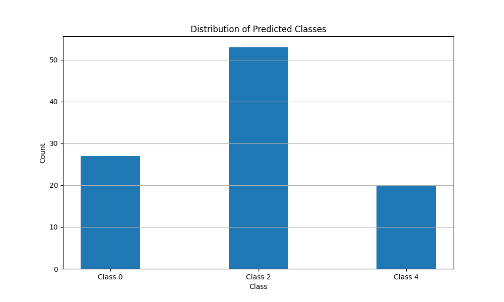

# AutoML Pipeline

## Overview
A simplified machine learning automation framework that handles the complexities of ML workflows through configuration. The project provides an easy-to-use interface for training machine learning models while automatically managing optimization, visualization, and training processes.

### Key Features
- **Automated Training**: Simplified training process with minimal user intervention
- **Configuration Templates**: Easy-to-use configuration templates for common ML tasks
- **Visualization**: Built-in visualization tools for performance analysis

### Performance Metrics
- Training Loss: 1.6422
- Validation Loss: 1.6169
- Learning Rate: 0.000896

### Visualization Analysis
1. **Class Distribution**:
   - Class 2 shows the highest prediction rate (~50 samples)
   - Class 0 (~27 samples) and Class 4 (~20 samples) show moderate representation
   - Shows room for balancing improvements


2. **Classification Matrix**:
   - Strong diagonal presence indicating good classification
   - Class 2 shows the highest confidence (10–14 correct predictions)
   - Some confusion between adjacent classes
   - Room for improvement in Class 3 discrimination


3. **Training Dynamics**:
   - Training loss shows healthy fluctuation (1.54–1.70)
   - Validation loss remains stable (~1.62)
   - Indicates good generalization without overfitting


4.**Learning Rate Schedule**:
   - Smooth cosine decay from 2e-3 to 9e-4
   - Proper annealing behavior
   - Suggests stable optimization

## Project Structure
```
automl/
├── lightning_auto.py   # Core AutoML engine
├── config.py          # Configuration templates
├── train.py          # Training script
├── WriterSide/             # Documentation
└── examples/         # Example notebooks # Coming soon!
```

## Quick Start
```python
from lightning_auto import AutoML
from config import get_classification_config

# Get configuration
config = get_classification_config()

# Initialize and train
auto_ml = AutoML(config)
auto_ml.fit(train_data, val_data)
```

## Configuration Templates
Current available templates:
```python
# Linear Classification
config = {
    "model": {
        "type": "classification",
        "input_dim": 10,
        "output_dim": 5,
        "task": "classification"
    },
    "training": {
        "learning_rate": 0.002,
        "epochs": 30
    }
    # ... other parameters
}
```

## Contributing
### Adding New Configuration Templates
1. Create a new function in `config.py`:
```python
def get_custom_config():
    return {
        "model": {
            # model specifications
        },
        "training": {
            # training parameters
        }
    }
```

2. Add documentation and example usage

3. Submit a pull request

### Backend Development
1. For new features:
   - Fork the repository
   - Create feature branch
   - Add tests
   - Submit pull request

<div style="text-align: center;">
  
</div>
