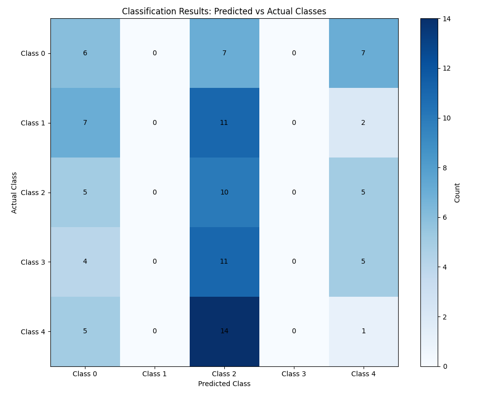
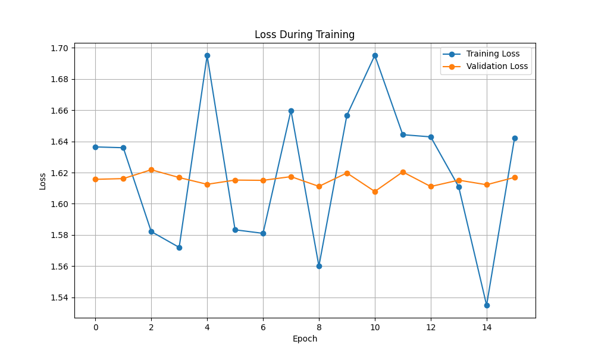
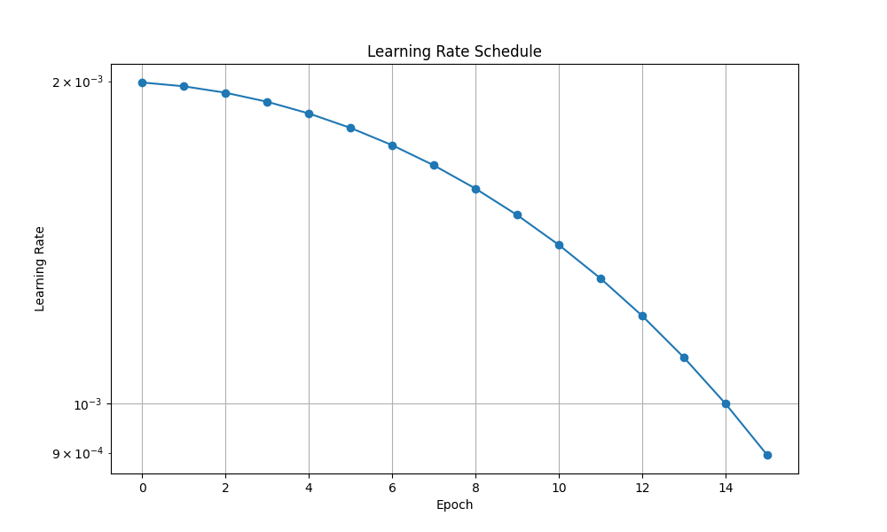

# AutoML Pipeline

A simplified machine learning automation framework that handles the complexities of ML workflows through configuration. The project provides an easy-to-use interface for training machine learning models while automatically managing optimization, visualization, and training processes.

> [!IMPORTANT]
> This framework is designed for rapid ML prototyping and experimentation. For production deployments, please review the performance metrics and model validation sections carefully.

## 🚀 Quick Start

```python
from lightning_auto import AutoML
from config import get_classification_config

# Get configuration
config = get_classification_config()

# Initialize and train
auto_ml = AutoML(config)
auto_ml.fit(train_data, val_data)
```

> [!TIP]
> Check the `examples/` directory for complete notebook demonstrations of common use cases.

## ✨ Key Features

- **Automated Training**: Simplified training process with minimal user intervention
- **Configuration Templates**: Easy-to-use configuration templates for common ML tasks
- **Visualization**: Built-in visualization tools for performance analysis

## 📊 Performance Metrics

> [!NOTE]
> These metrics represent baseline performance and may vary based on your dataset and configuration.

- Training Loss: 1.6422
- Validation Loss: 1.6169
- Learning Rate: 0.000896

## 📈 Visualization Analysis

### 1. Class Distribution


> [!NOTE]
> The distribution plot shows:
> - Class 2 dominates with ~50 samples
> - Class 0 follows with ~27 samples
> - Class 4 has the least representation with ~20 samples
> - Clear sign of class imbalance that may need addressing

### 2. Classification Results


> [!NOTE]
> Key observations from the confusion matrix:
> - Strong diagonal pattern indicates good overall classification
> - Class 2 shows the highest confidence with 10–14 correct predictions
> - Some classifications between neighboring classes
> - Class 3 shows room for improvement in discrimination

### 3. Training Dynamics


> [!NOTE]
> The loss plot reveals:
> - Training loss (blue) shows healthy fluctuation between 1.54–1.70
> - Validation loss (orange) maintains stability around 1.62
> - No significant overfitting as validation loss remains stable
> - Good model convergence with occasional exploration spikes

### 4. Learning Rate Schedule


> [!NOTE]
> The learning rate schedule demonstrates:
> - Smooth cosine decay from 2e-3 to 9e-4
> - Gradual learning rate reduction for fine-tuning
> - Proper annealing behavior for optimization stability

## 📁 Project Structure

```
automl/
├── lightning_auto.py   # Core AutoML engine
├── config.py          # Configuration templates
├── train.py          # Training script
├── WriterSide/       # Documentation
└── examples/         # Example notebooks (Coming soon!)
```

## ⚙️ Configuration Templates

> [!WARNING]
> Always validate configuration parameters against your specific use case before training.

### Linear Classification Example
```python
config = {
    "model": {
        "type": "classification",
        "input_dim": 10,
        "output_dim": 5,
        "task": "classification"
    },
    "training": {
        "learning_rate": 0.002,
        "epochs": 30
    }
    # ... other parameters
}
```

## 🤝 Contributing

> [!CAUTION]
> Before submitting large changes, please open an issue to discuss the proposed modifications.

### Adding New Configuration Templates

1. Create a new function in `config.py`:
```python
def get_custom_config():
    return {
        "model": {
            # model specifications
        },
        "training": {
            # training parameters
        }
    }
```
1. Add documentation and example usage
2. Submit a pull request

### Backend Development

1. For new features:
   - Fork the repository
   - Create feature branch
   - Add tests
   - Submit pull request

## 📝 License

This project is licensed under the MIT License—see the LICENSE file for details.
