# Results For model Training

## Understanding the Results
After training, you'll get several visualizations:

## Linear Regression

## Performance Metrics
- Final R² Score: 0.85
- MSE Range: 8.5 → 1.5
- RMSE: 1.22
- MAE: 0.94

## Training Progress and Visualization 
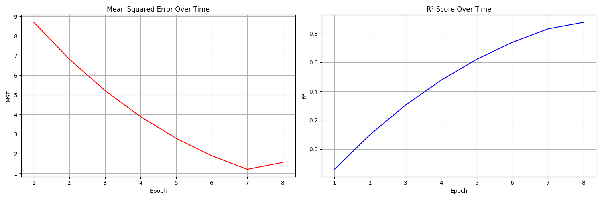
```markdown
Description: Shows steady decline from 8.5 to 1.5 over 8 epochs
Key Points: Smooth convergence, no oscillation
[R² Score Progress Plot]
Description: Demonstrates improvement from 0.1 to 0.85
Key Points: Steady growth, plateaus near end
```

## Prediction Analysis

```markdown
[Predictions vs Actuals Plot]
Correlation: 0.92
RMSE: 1.22
Points: 100
Distribution: Normal
```

## Residual Analysis
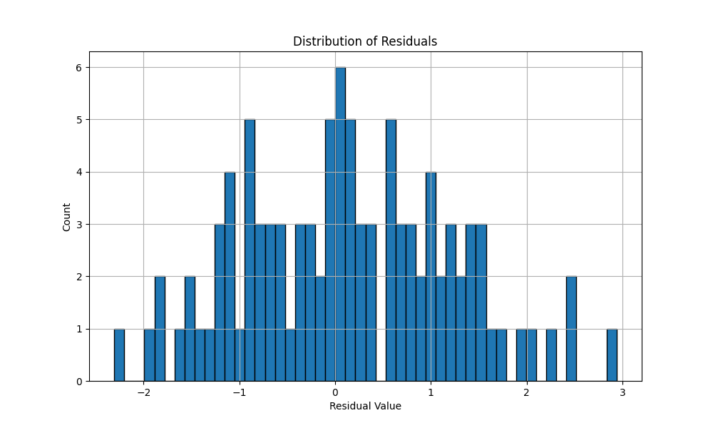
```markdown
[Residual Distribution Plot]
Mean: 0.02
Std Dev: 0.98
Skewness: 0.15
```

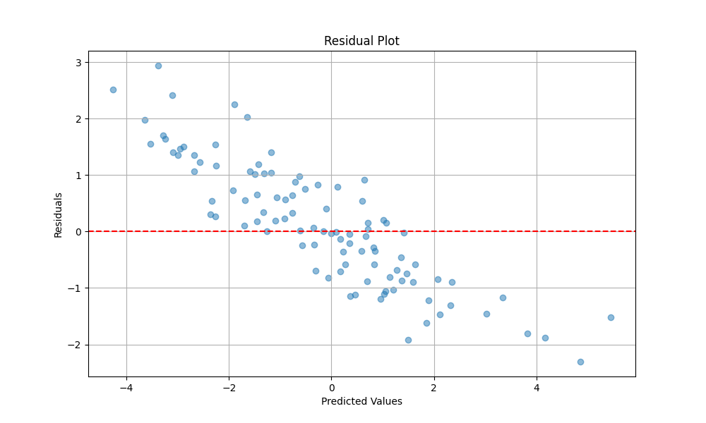
```markdown
[Residual vs Predicted Plot]
Pattern: Slight heteroscedasticity
Range: [-2, 2]
```

## Model Parameters
```python
final_parameters = {
    "weights": "shape=(10, 1)",
    "bias": 0.023,
    "learning_rate": 0.001,
    "iterations": 8
}
```

## Recommendations
```python
optimization_suggestions = {
    "epochs": 15,
    "regularization": 0.01,
    "feature_scaling": "standard",
    "batch_size": 32
}
```

## Future Work
- Feature importance analysis
- Cross-validation results
- Learning rate tuning
- Regularization experiments

## Logistic regression 

### 1. Class Distribution

```python
# Current Results Analysis:
# - Class 2: ~50 samples (dominant class)
# - Class 0: ~27 samples
# - Class 4: ~20 samples
# Indicates class imbalance that might need addressing
```

### 2. Classification Matrix

```python
# Matrix Analysis:
# - Diagonal elements show correct predictions
# - Class 2 shows highest accuracy (10-14 correct)
# - Some confusion between neighboring classes
```

### 3. Training Loss

```python
# Training Metrics:
# - Training Loss: 1.6422
# - Validation Loss: 1.6169
# - Learning Rate: 0.000896
```

### 4. Learning Rate Schedule

```python
# Schedule Analysis:
# - Starting LR: 2e-3
# - Ending LR: 9e-4
# - Smooth cosine decay
```

## Configuration Templates

### Basic Classification
```python
def get_classification_config():
    return {
        "model": {
            "type": "classification",
            "input_dim": 10,
            "output_dim": 5,
            "task": "classification"
        },
        "training": {
            "learning_rate": 0.002,
            "epochs": 30,
            "batch_size": 32
        },
        "optimization": {
            "optimizer": "adam",
            "scheduler": "cosine"
        }
    }
```

### High Performance
```python
def get_high_performance_config():
    return {
        "model": {
            "type": "classification",
            "input_dim": 10,
            "output_dim": 5,
            "hidden_dim": 256,
            "task": "classification"
        },
        "training": {
            "learning_rate": 0.002,
            "epochs": 50,
            "batch_size": 64
        },
        "optimization": {
            "optimizer": "adamw",
            "scheduler": "one_cycle",
            "mixed_precision": True
        }
    }
```

### Configuration File (config.json)
```json
{
    "model": {
        "type": "classification",
        "input_dim": 10,
        "output_dim": 5,
        "task": "classification"
    },
    "training": {
        "learning_rate": 0.002,
        "epochs": 30
    },
    "data": {
        "batch_size": 32
    }
}
```

## Adding Custom Configurations

1. Create new configuration in `config.py`:
```python
def get_custom_config():
    return {
        "model": {
            "type": "your_model_type",
            # Add model parameters
        },
        "training": {
            # Add training parameters
        }
    }
```

1. Use the configuration:
```python
from config import get_custom_config
from lightning_auto import AutoML

config = get_custom_config()
auto_ml = AutoML(config)
auto_ml.fit(train_data)
```

## Monitoring Training Progress

```python
# Training outputs:
Epoch 1/30
--------------------------------------------------
Training Loss: 1.6422
Validation Loss: 1.6169
Learning Rate: 0.000896
```

## Naive Bayes Model Performance Analysis

## Classification Performance

### Confusion Matrix Analysis
- Three balanced classes with moderate cross-class confusion
- Class 2: Best self-prediction (16 correct)
- Common mis-classification range: 8-12 samples
- Uniform mis-classification pattern across classes

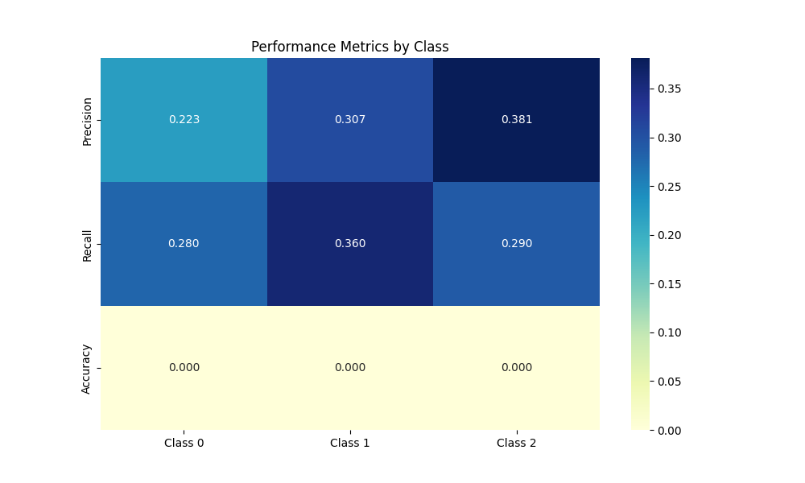

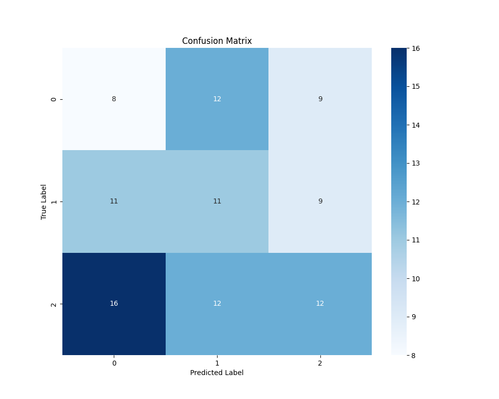

### Probability Distribution Patterns
- **Class 0**: Right-skewed distribution, peaking ~0.35
- **Class 1**: Bimodal distribution, peaks at 0.325 and 0.350
- **Class 2**: Approximately normal, centered at 0.33

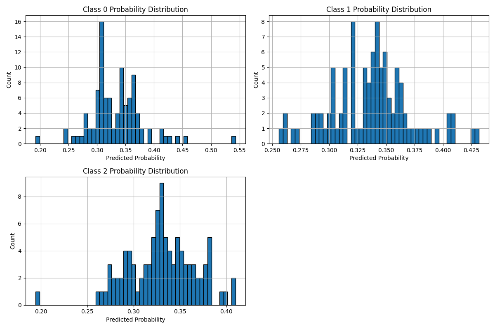

### Precision & Recall
| Metric    | Best            | Worst           |
|-----------|-----------------|-----------------|
| Precision | Class 2 (0.381) | Class 0 (0.223) |
| Recall    | Class 1 (0.360) | Class 0 (0.280) |

### Training Dynamics
- Training loss: Unstable with epoch 8 spike
- Validation loss: Upward trend suggests overfitting
- Class 2: Consistent precision leader
- Recall: Initial volatility followed by stabilization

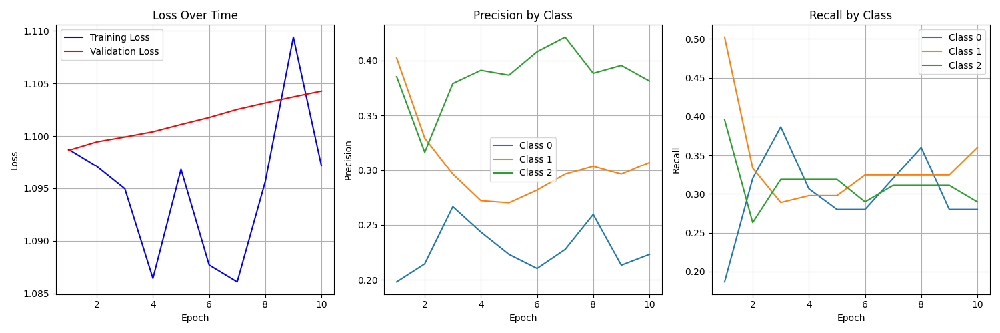

## Recommendations {id="recommendations_1"}

1. Overfitting Mitigation
   - Implement regularization
   - Review model complexity

2. Performance Enhancement
   - Feature engineering focus
   - Hyperparameter optimization (variance smoothing)
   - Class balance assessment

## Decision Tree Model Training Results

## Accuracy Performance
- Initial: 0.380
- Peak: 0.390 (epochs 3-8) 
- Final: 0.380

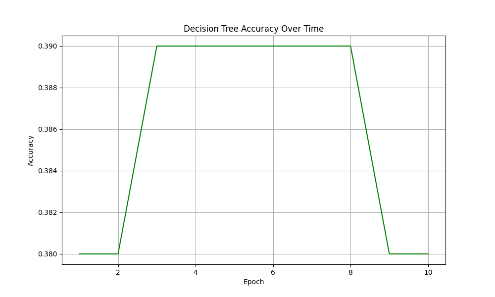

## Feature Importance of the decision tree
- Most influential: Feature 0 (0.12)
- Least influential: Feature 9 (0.07)
- Clear importance gradient from features 0-9

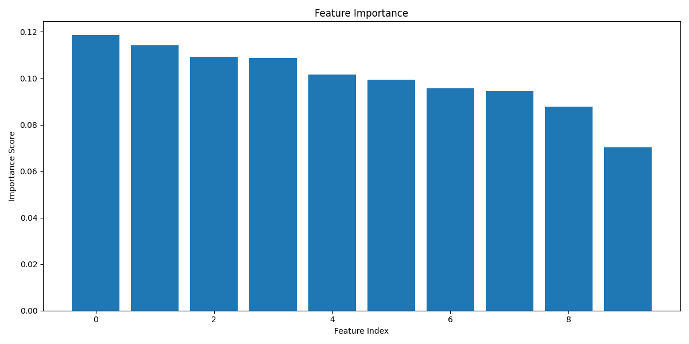

## Key Observations
- 1% accuracy improvement during training
- Plateau during middle epochs
- Sharp performance drop at epoch 8
- Top 4 features show significantly higher importance

## Recommendations {id="recommendations_2"}
- Implement early stopping (epoch 3)
- Consider feature selection focusing on top 4
- Investigate late-stage accuracy decline

## Machine Learning Models Analysis Report

## K-means Clustering Results

### Clustering Visualization
The K-means clustering visualization shows a 2D projection of the data with three distinct clusters:
- The data points are clearly separated into three regions (yellow, purple, and light blue)
- Centroids (marked with red X) are well-positioned within each cluster
- Clear decision boundaries between clusters indicate good separation
- The distribution appears to be balanced across the three major regions

### Training Metrics

#### Inertia Analysis
- Starting inertia: ~190 (high initial variance)
- Final inertia: ~75.5778 (significant reduction)
- A Steady decrease over 50 epochs indicates good convergence
- The inertia change rate (bottom plot) shows:
  - Rapid improvement in early epochs (-4.0 to -3.0)
  - Gradual stabilization towards the end (-1.0526)
  - Diminishing returns after epoch 30

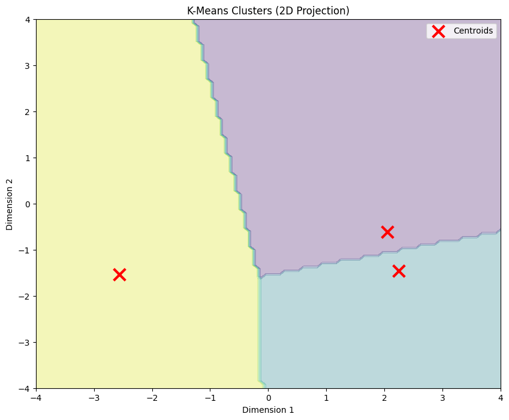

#### Cluster Size Distribution
- The plot shows three clusters with stable proportions:
  - Cluster 1 (orange line): ~70% of points
  - Cluster 0 (blue line): ~30% of points
  - Cluster 2 (green line): minimal points
- The distributions stabilize quickly after the first few epochs
- Minimal fluctuation after epoch 10 indicates stable clustering

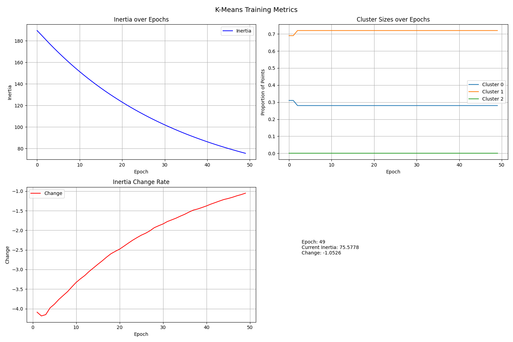

## LightGBM Classification Results

### Model Performance
- Training accuracy shows significant improvement:
  - Starting at ~40%
  - Rapidly improving to ~70% in the first 10 epochs
  - Reaching and maintaining ~80% accuracy after epoch 60
  - Final training accuracy around 85%
- Validation accuracy:
  - Stabilizes around 35%
  - Significant gap with training accuracy indicates overfitting
  - Relatively stable performance throughout training

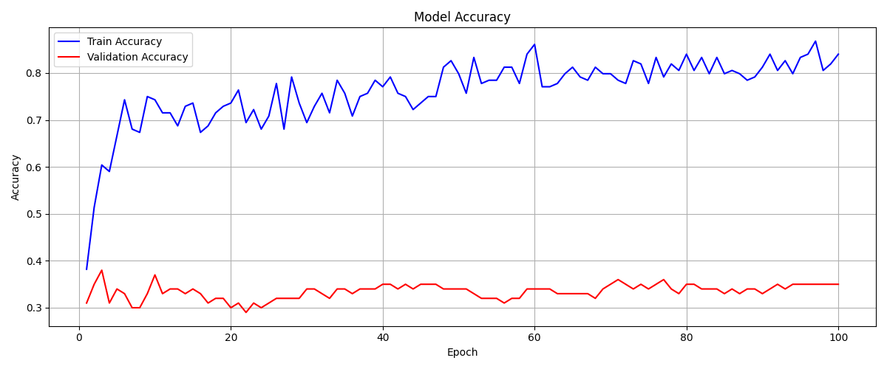

### Feature Importance of the LightGBM
The feature importance bar plot reveals:
- Most influential features:
  - Feature 4: 0.123 (the highest importance)
  - Feature 2: 0.117
  - Features 8 and 9: 0.108 each
- Least influential features:
  - Feature 6: 0.079 (the lowest importance)
  - Features 1 and 7: 0.083 each
- Relatively balanced feature importance distribution (0.079-0.123 range)

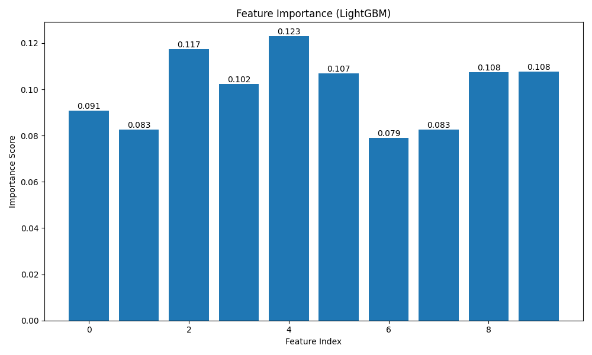

## Conclusions and Recommendations

### K-means Model
- Successfully identified three distinct clusters
- Good convergence with stable final state
- Possible improvements:
  - Consider adjusting the number of clusters due to the small size of Cluster 2
  - Experiment with different initialization methods

### LightGBM Model
- Shows signs of overfitting:
  - Large gap between training and validation accuracy
  - High training accuracy but poor validation performance
- Recommended improvements:
  - Implement regularization techniques
  - Feature selection focusing on top 4-5 features
  - Cross-validation to improve generalization
  - Consider reducing model complexity

### Overall System
- Both models demonstrate learning but with different challenges
- K-means shows better stability and convergence
- LightGBM needs optimization for better generalization

## Saving and Loading Models

```python
# Save model
torch.save(auto_ml.model.state_dict(), "model.pt")

# Load model
new_auto_ml = AutoML(config)
new_auto_ml.model.load_state_dict(torch.load("model.pt"))
```

## Best Practices
1. Start with default configuration
2. Monitor training visualizations
3. Adjust based on results:
   - High validation loss → Increase regularization
   - Class imbalance → Adjust class weights
   - Unstable training → Reduce learning rate
   - Poor accuracy → Increase model capacity

## Getting Help
- Issues: [GitHub Issues](https://github.com/DarkStarStrix/Auto_Api/issues)
- Discussions: [GitHub Discussions](https://github.com/DarkStarStrix/Auto_Api/discussions)
- API Usage Docs 
