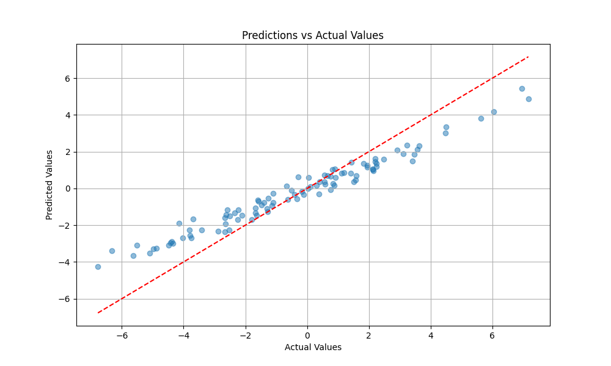
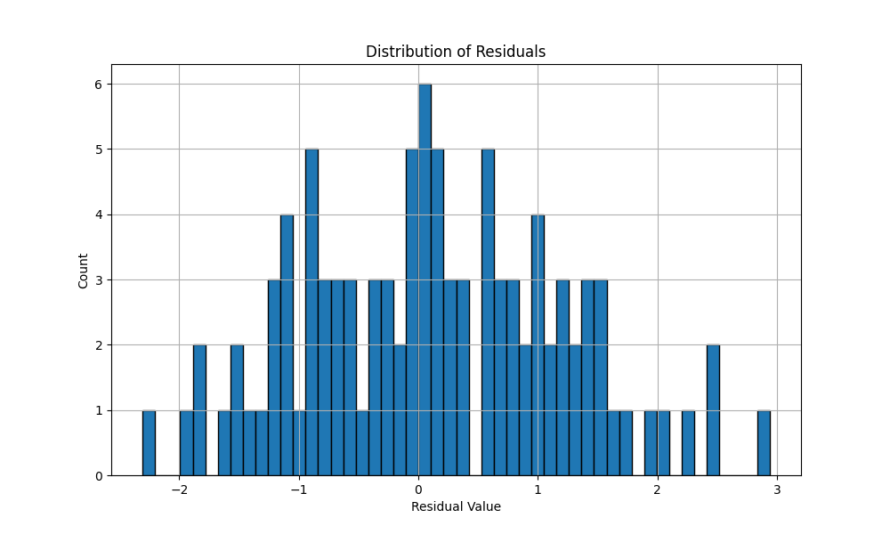

# Results For model Training

## Understanding the Results
After training, you'll get several visualizations:

## Linear Regression

## Performance Metrics
- Final R² Score: 0.85
- MSE Range: 8.5 → 1.5
- RMSE: 1.22
- MAE: 0.94

## Training Progress and Visualization 

```markdown
Description: Shows steady decline from 8.5 to 1.5 over 8 epochs
Key Points: Smooth convergence, no oscillation
[R² Score Progress Plot]
Description: Demonstrates improvement from 0.1 to 0.85
Key Points: Steady growth, plateaus near end
```

## Prediction Analysis

```markdown
[Predictions vs Actuals Plot]
Correlation: 0.92
RMSE: 1.22
Points: 100
Distribution: Normal
```

## Residual Analysis

```markdown
[Residual Distribution Plot]
Mean: 0.02
Std Dev: 0.98
Skewness: 0.15
```


```markdown
[Residual vs Predicted Plot]
Pattern: Slight heteroscedasticity
Range: [-2, 2]
```

## Model Parameters
```python
final_parameters = {
    "weights": "shape=(10, 1)",
    "bias": 0.023,
    "learning_rate": 0.001,
    "iterations": 8
}
```

## Recommendations
```python
optimization_suggestions = {
    "epochs": 15,
    "regularization": 0.01,
    "feature_scaling": "standard",
    "batch_size": 32
}
```

## Future Work
- Feature importance analysis
- Cross-validation results
- Learning rate tuning
- Regularization experiments

## Logistic regression 

### 1. Class Distribution

```python
# Current Results Analysis:
# - Class 2: ~50 samples (dominant class)
# - Class 0: ~27 samples
# - Class 4: ~20 samples
# Indicates class imbalance that might need addressing
```

### 2. Classification Matrix

```python
# Matrix Analysis:
# - Diagonal elements show correct predictions
# - Class 2 shows highest accuracy (10-14 correct)
# - Some confusion between neighboring classes
```

### 3. Training Loss

```python
# Training Metrics:
# - Training Loss: 1.6422
# - Validation Loss: 1.6169
# - Learning Rate: 0.000896
```

### 4. Learning Rate Schedule

```python
# Schedule Analysis:
# - Starting LR: 2e-3
# - Ending LR: 9e-4
# - Smooth cosine decay
```

## Configuration Templates

### Basic Classification
```python
def get_classification_config():
    return {
        "model": {
            "type": "classification",
            "input_dim": 10,
            "output_dim": 5,
            "task": "classification"
        },
        "training": {
            "learning_rate": 0.002,
            "epochs": 30,
            "batch_size": 32
        },
        "optimization": {
            "optimizer": "adam",
            "scheduler": "cosine"
        }
    }
```

### High Performance
```python
def get_high_performance_config():
    return {
        "model": {
            "type": "classification",
            "input_dim": 10,
            "output_dim": 5,
            "hidden_dim": 256,
            "task": "classification"
        },
        "training": {
            "learning_rate": 0.002,
            "epochs": 50,
            "batch_size": 64
        },
        "optimization": {
            "optimizer": "adamw",
            "scheduler": "one_cycle",
            "mixed_precision": True
        }
    }
```

### Configuration File (config.json)
```json
{
    "model": {
        "type": "classification",
        "input_dim": 10,
        "output_dim": 5,
        "task": "classification"
    },
    "training": {
        "learning_rate": 0.002,
        "epochs": 30
    },
    "data": {
        "batch_size": 32
    }
}
```

## Adding Custom Configurations

1. Create new configuration in `config.py`:
```python
def get_custom_config():
    return {
        "model": {
            "type": "your_model_type",
            # Add model parameters
        },
        "training": {
            # Add training parameters
        }
    }
```

2. Use the configuration:
```python
from config import get_custom_config
from lightning_auto import AutoML

config = get_custom_config()
auto_ml = AutoML(config)
auto_ml.fit(train_data)
```

## Monitoring Training Progress

```python
# Training outputs:
Epoch 1/30
--------------------------------------------------
Training Loss: 1.6422
Validation Loss: 1.6169
Learning Rate: 0.000896
```

## Saving and Loading Models

```python
# Save model
torch.save(auto_ml.model.state_dict(), "model.pt")

# Load model
new_auto_ml = AutoML(config)
new_auto_ml.model.load_state_dict(torch.load("model.pt"))
```

## Best Practices
1. Start with default configuration
2. Monitor training visualizations
3. Adjust based on results:
   - High validation loss → Increase regularization
   - Class imbalance → Adjust class weights
   - Unstable training → Reduce learning rate
   - Poor accuracy → Increase model capacity

## Getting Help
- Issues: [GitHub Issues](https://github.com/DarkStarStrix/Auto_Api/issues)
- Discussions: [GitHub Discussions](https://github.com/DarkStarStrix/Auto_Api/discussions)
- API Usage Docs 
