# About How it works

## File Structure Overview
This file contains the core implementation of the AutoML system with four main parts:

## AutoML Framework: A Comprehensive Guide and Implementation

The AutoML Framework provides streamlined machine learning automation by implementing a series of interconnected functions. Starting with data processing, we have `_convert_to_dataset(data)` which handles data conversion:

```python
def _convert_to_dataset(data):
    """Convert raw data to PyTorch Dataset."""
    if isinstance(data, np.ndarray):
        data = torch.from_numpy(data)
    if isinstance(data, torch.Tensor):
        features = data[:, :-1]
        targets = data[:, -1]
        return TensorDataset(features, targets)
```

This works alongside `_prepare_data(data)` for validation and preparation:

```python
def _prepare_data(data):
    if isinstance(data, np.ndarray):
        features = torch.FloatTensor(data[:, :-1])
        targets = torch.FloatTensor(data[:, -1])
        return TensorDataset(features, targets)
    raise ValueError("Data must be numpy array")
```

The core functionality resides in the AutoML class:

```python
class AutoML:
    def __init__(self, config: Dict[str, Any]):
        self.config = config
        self.model = self._create_model()
    
    def _create_model(self):
        model_type = self.config['model']['type']
        if model_type == 'logistic_regression':
            return LogisticRegressionModel(self.config)
        elif model_type == 'linear_regression':
            return LinearRegressionModel(self.config)
        raise ValueError(f"Unsupported model type: {model_type}")

    def fit(self, train_data, val_data=None):
        train_dataset = self._prepare_data(train_data)
        val_dataset = self._prepare_data(val_data) if val_data else None
        train_loader = DataLoader(
            train_dataset,
            batch_size=self.config.get('batch_size', 32),
            shuffle=True
        )
        trainer = pl.Trainer(
            max_epochs=self.config.get('epochs', 10),
            accelerator="auto",
            devices="auto"
        )
        trainer.fit(self.model, train_loader, val_loader)
        return self.model
```

Training operations are handled through specific functions:

```python
def _compute_loss(self, batch):
    features, targets = batch
    outputs = self.model(features)
    if self.config['model']['task'] == 'classification':
        targets = targets.long()
        loss = nn.CrossEntropyLoss()(outputs, targets)
        with torch.no_grad():
            predictions = outputs.argmax(dim=1)
            accuracy = (predictions == targets).float().mean()
            self.log('accuracy', accuracy, prog_bar=True)
    else:
        loss = nn.MSELoss()(outputs, targets)
    return loss
```

Progress tracking and metrics are managed by the MetricsCallback:

```python
class MetricsCallback(Callback):
    def __init__(self):
        super().__init__()
        self.epoch_metrics = {}

    def on_train_epoch_start(self, trainer, pl_module):
        print(f"\nEpoch {trainer.current_epoch + 1}/{trainer.max_epochs}")

    def on_train_epoch_end(self, trainer, pl_module):
        metrics = {
            'Training Loss': f"{trainer.callback_metrics.get('train_loss', 0):.4f}",
            'Validation Loss': f"{trainer.callback_metrics.get('val_loss', 0):.4f}",
            'Learning Rate': f"{trainer.optimizers[0].param_groups[0]['lr']:.6f}"
        }
        print("\nEpoch Summary:")
        for name, value in metrics.items():
            print(f"{name}: {value}")
```

This system integrates all components into a seamless pipeline, handling everything from data preprocessing to model training and evaluation. Users can initialize the system with a configuration dictionary, feed in their data, and receive a trained model with comprehensive metrics tracking throughout the process. The framework supports both classification and regression tasks, with built-in error handling and progress monitoring.

Usage is straightforward:
```python
config = {
    "model": {
        "type": "logistic_regression",
        "input_dim": 10,
        "output_dim": 2,
        "task": "classification"
    },
    "training": {
        "learning_rate": 0.001,
        "epochs": 10
    }
}

automl = AutoML(config)
model = automl.fit(train_data, val_data)
```


## File Dependencies

## AutoML Implementation: A Complete Guide

The AutoML framework follows a straightforward three-step implementation process. Here's how it works with complete code examples:

```python
# Step 1: Configuration and Initialization
config = {
    "model": {
        "type": "logistic_regression",
        "input_dim": 10,
        "output_dim": 2,
        "task": "classification"
    },
    "training": {
        "learning_rate": 0.001,
        "epochs": 10,
        "batch_size": 32,
        "early_stopping": True
    }
}

auto_ml = AutoML(config)
```

The framework handles data preparation with built-in conversion functions:

```python
def prepare_data():
    # Load and preprocess your data
    data = np.random.randn(1000, 11)  # Example data
    train_size = int(0.8 * len(data))
    
    train_data = data[:train_size]
    val_data = data[train_size:]
    
    # Convert to PyTorch format
    def convert_to_dataset(data):
        if isinstance(data, np.ndarray):
            data = torch.from_numpy(data).float()
        features = data[:, :-1]
        targets = data[:, -1]
        return TensorDataset(features, targets)
    
    return convert_to_dataset(train_data), convert_to_dataset(val_data)

# Get your data ready
train_data, val_data = prepare_data()
```

Model training and monitoring are handled through the comprehensive training loop:

```python
class AutoMLTrainer:
    def fit(self, train_data, val_data):
        # Setup training
        train_loader = DataLoader(
            train_data,
            batch_size=self.config["training"]["batch_size"],
            shuffle=True
        )
        
        val_loader = DataLoader(val_data, batch_size=self.config["training"]["batch_size"])
        
        # Training loop with metrics
        def training_step(self, batch, batch_idx):
            with autocast(enabled=self.use_amp):
                features, targets = batch
                outputs = self.model(features)
                loss = self._compute_loss(outputs, targets)
                
                # Log metrics
                self.log('train_loss', loss)
                if self.config["model"]["task"] == "classification":
                    accuracy = (outputs.argmax(dim=1) == targets).float().mean()
                    self.log('train_accuracy', accuracy)
            
            return loss
        
        # Setup trainer with callbacks
        trainer = pl.Trainer(
            max_epochs=self.config["training"]["epochs"],
            callbacks=[MetricsCallback()],
            enable_progress_bar=True
        )
        
        # Start training
        trainer.fit(self.model, train_loader, val_loader)
        return self.model

# Create metrics callback for monitoring
class MetricsCallback(Callback):
    def __init__(self):
        self.metrics = {}
    
    def on_train_epoch_end(self, trainer, pl_module):
        metrics = {
            'Training Loss': f"{trainer.callback_metrics.get('train_loss', 0):.4f}",
            'Validation Loss': f"{trainer.callback_metrics.get('val_loss', 0):.4f}",
            'Learning Rate': f"{trainer.optimizers[0].param_groups[0]['lr']:.6f}"
        }
        
        print("\nEpoch Summary:")
        for name, value in metrics.items():
            print(f"{name}: {value}")
```

Finally, train your model:

```python
# Train the model
model = auto_ml.fit(train_data, val_data)

# Get predictions
with torch.no_grad():
    predictions = model(test_features)
```

This implementation provides:
- Automated data handling and conversion
- Dynamic model creation based on configuration
- Comprehensive training loop with metrics tracking
- Built-in validation and error handling
- Progress monitoring and reporting

The system can be extended with custom models:

```python
class CustomModel(BaseModel):
    def __init__(self, config):
        super().__init__()
        self.config = config
        self.layers = nn.Sequential(
            nn.Linear(config["model"]["input_dim"], 64),
            nn.ReLU(),
            nn.Linear(64, config["model"]["output_dim"])
        )
    
    def forward(self, x):
        return self.layers(x)
```

## BaseModel Documentation

## Overview {id="overview_1"}
The `BaseModel` class serves as an abstract base class for implementing machine learning models using PyTorch Lightning. It provides a standardized interface and common functionality for different model types.

## Class Structure {id="class-structure_1"}

### Class Hierarchy
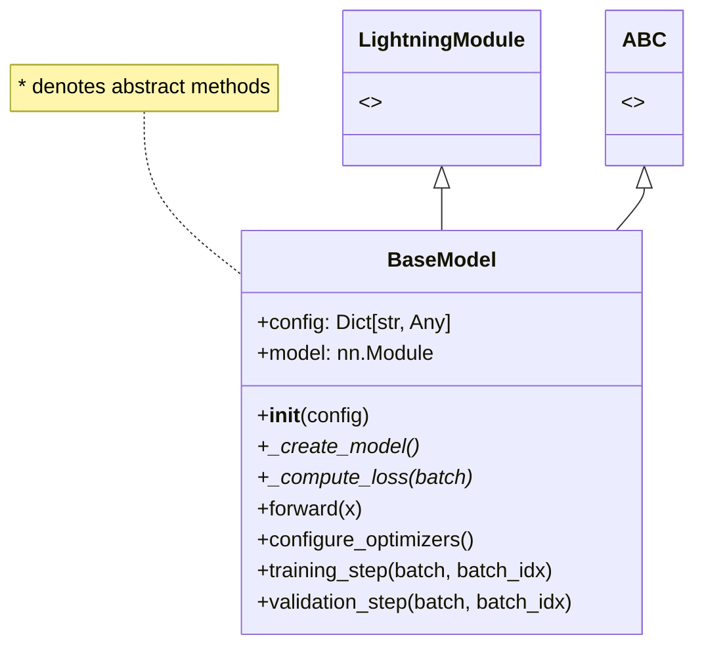

### Data Flow {id="data-flow_2"}
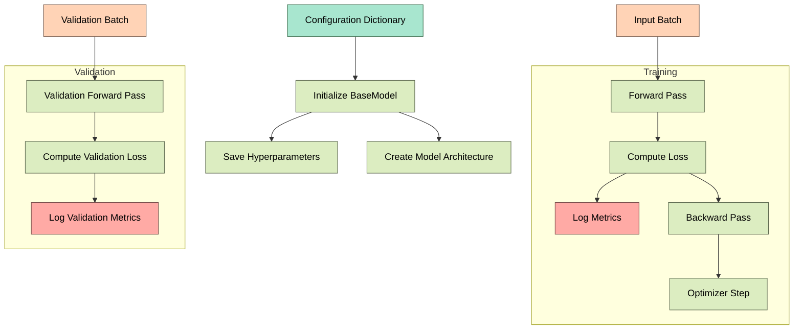

## Core Components

### 1. Initialization
```python
def __init__(self, config: Dict[str, Any]):
    super().__init__()
    self.config = config
    self.save_hyperparameters(config)
    self.model = self._create_model()
```
- Stores configuration dictionary
- Save hyperparameters for experiment tracking
- Creates model architecture through abstract method

### 2. Abstract Methods
```python
@abstractmethod
def _create_model(self):
    pass

@abstractmethod
def _compute_loss(self, batch):
    pass
```
These methods must be implemented by child classes to define:
- Model architecture specification
- Loss computation logic

### 3. Forward Pass
```python
def forward(self, x):
    return self.model(x)
```
- Defines the forward pass through the model
- Called during both training and inference

### 4. Training and Validation Steps
```python
def training_step(self, batch, batch_idx):
    loss = self._compute_loss(batch)
    self.log('train_loss', loss)
    return loss

def validation_step(self, batch, batch_idx):
    loss = self._compute_loss(batch)
    self.log('val_loss', loss)
    return loss
```

## Implementation Requirements

### Required Config Structure
```python
config = {
    "model": {
        "type": str,
        "input_dim": int,
        # ... other model-specific parameters
    },
    "training": {
        "learning_rate": float,
        # ... other training parameters
    }
}
```

### Child Class Implementation
```python
class CustomModel(BaseModel):
    def _create_model(self):
        # Define model architecture
        return model
        
    def _compute_loss(self, batch):
        # Define loss computation
        return loss
```

## Best Practices {id="best-practices_1"}

1. **Configuration Management**
   - Store all hyperparameters in config
   - Use config.get() with defaults
   - Document required config parameters

2. **Loss Computation**
   - Handle batch unpacking consistently
   - Implement proper metric logging
   - Handle edge cases and errors

3. **Memory Management**
   - Clear cache when needed
   - Use proper device management
   - Handle batch dimensions correctly

## Usage Example {id="usage-example_1"}

```python
# Create config
config = {
    "model": {
        "type": "custom",
        "input_dim": 10
    },
    "training": {
        "learning_rate": 0.001
    }
}

# Initialize model
model = CustomModel(config)

# Setup trainer
trainer = pl.Trainer()

# Train model
trainer.fit(model, train_dataloader, val_dataloader)
```

## Common Implementations

BaseModel is typically extended for:
1. Logistic Regression
2. Linear Regression
3. Neural Networks
4. Custom model architectures

Each implementation must provide:
- Model architecture via `_create_model()`
- Loss computation via `_compute_loss()`
- Any additional metrics or logging

## Error Handling {id="error-handling_1"}

Common issues to watch for:
1. Incorrect config structure
2. Mismatched tensor dimensions
3. Memory leaks in training loop
4. Invalid loss computations

## Model Types Implementation Documentation

## Overview
This file implements a hierarchical model structure for machine learning tasks, specifically focusing on logistic and linear regression models. It uses PyTorch Lightning for training abstractions and includes integrated visualization capabilities.

## Class Structure

### BaseModel
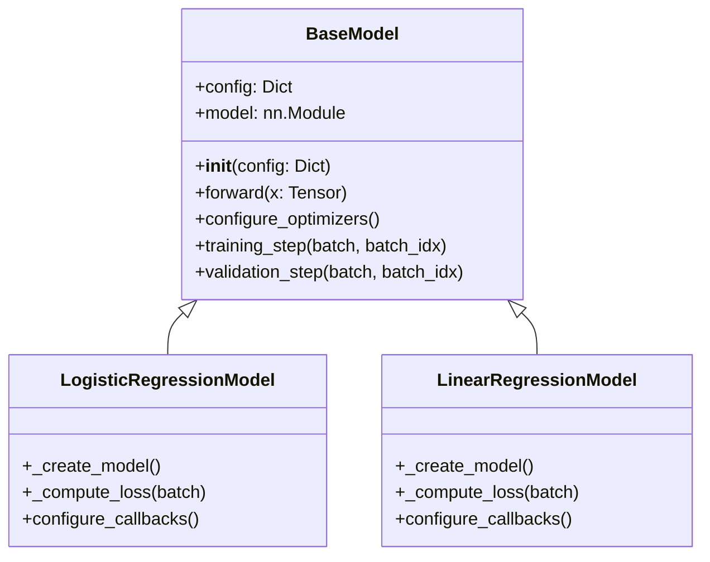

## Detailed Components

### 1. BaseModel
Abstract base class providing common functionality for all models.

```python
class BaseModel(pl.LightningModule):
```

#### Key Methods:
- `__init__(config)`: Initializes model with configuration
- `forward(x)`: Defines forward pass
- `training_step(batch, batch_idx)`: Handles training iterations
- `validation_step(batch, batch_idx)`: Handles validation iterations
- `configure_optimizers()`: Sets up Adam optimizer

### 2. LogisticRegressionModel
Implementation for binary classification tasks.

```python
class LogisticRegressionModel(BaseModel):
```

#### Architecture: {id="architecture_1"}
- Input Layer → Single Linear Layer → Sigmoid Activation
- Output: Probability (0-1)

#### Metrics: {id="metrics_1"}
- Accuracy
- Precision
- Recall
- Binary Cross-Entropy Loss

### 3. LinearRegressionModel
Implementation for regression tasks.

```python
class LinearRegressionModel(BaseModel):
```

#### Architecture:
- Single Linear Layer
- Output: Continuous Value

#### Metrics:
- Mean Squared Error (MSE)
- R² Score

## Data Flow {id="data-flow_1"}

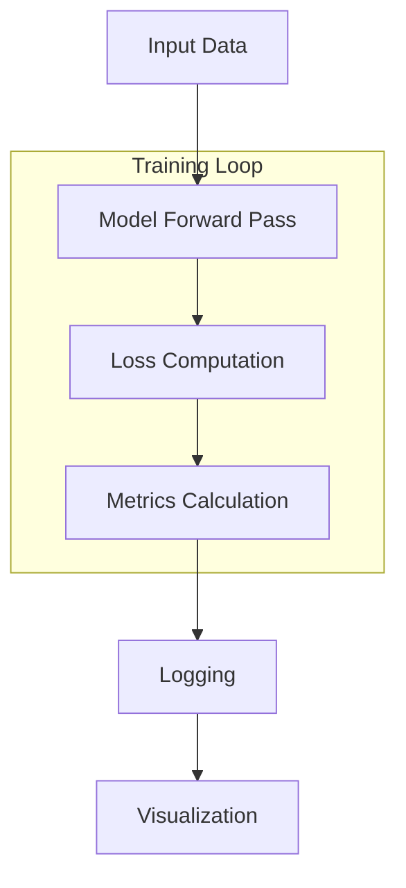

## Key Features

### 1. Configuration Management
```python
self.config = config
self.save_hyperparameters(config)
```
- Stores model configuration
- Save hyperparameters for experiment tracking

### 2. Loss Computation
Both models include specialized loss computation:

```python
# Logistic Regression
BCE_loss = nn.BCELoss()(predictions, targets)

# Linear Regression
MSE_loss = nn.MSELoss()(predictions, targets)
```

### 3. Metric Tracking
```python
# For Logistic Regression
accuracy = (predictions == targets).float().mean()
precision = true_positives / predicted_positives
recall = true_positives / actual_positives

# For Linear Regression
mse = loss
r2_score = 1 - ss_res / ss_tot
```

### 4. Visualization Integration
Each model type has its own visualizer:
```python
def configure_callbacks(self):
    return [LogisticRegressionVisualizer()]  # or LinearRegressionVisualizer()
```

## Usage Example

```python
# Configuration
config = {
    "model": {
        "type": "logistic_regression",
        "input_dim": 10
    },
    "training": {
        "learning_rate": 0.001
    }
}

# Create model
model = LogisticRegressionModel(config)

# Train model
trainer = pl.Trainer()
trainer.fit(model, train_dataloader, val_dataloader)
```

## Important Notes

1. **Data Preprocessing**:
   - Input tensors are automatically reshaped
   - All inputs are converted to float
   - Targets are reshaped to [batch_size, 1]

2. **Metric Logging**:
   - All metrics are logged with progress bar
   - Metrics are computed without gradients
   - Zero divisions are handled safely

3. **Visualization**:
   - Each model has specific visualizations
   - Callbacks handle metric plotting
   - Training progress is visualized

4. **Performance Considerations**:
   - Gradient computation is disabled for metrics
   - Tensor operations are batched
   - Proper dimension handling prevents broadcasting issues

## config.py

The provided code in `Config.py` defines configuration templates for different types of machine learning models, including linear models, transformers, and convolutional neural networks (CNNs). Each configuration is tailored to optimize the performance of the respective model type.

### Linear Model Configuration

The `get_linear_config` function returns a configuration dictionary optimized for linear models, particularly for classification tasks. The model configuration specifies the input, hidden, and output dimensions, along with architectural details such as dropout rate, activation function, number of layers, and batch normalization:

```python
"model": {
    "type": "classification",
    "input_dim": 10,
    "hidden_dim": 256,
    "output_dim": 5,
    "task": "classification",
    "architecture": {
        "dropout_rate": 0.3,
        "activation": "relu",
        "num_layers": 3,
        "batch_norm": True
    }
}
```

The training configuration includes parameters like learning rate, number of epochs, batch size, and early stopping criteria:

```python
"training": {
    "learning_rate": 0.002,
    "epochs": 30,
    "batch_size": 32,
    "early_stopping": True,
    "patience": 7
}
```

The optimization settings specify the optimizer type, learning rate scheduler, weight decay, and gradient clipping value:

```python
"optimization": {
    "optimizer": "adam",
    "scheduler": "cosine",
    "weight_decay": 0.01,
    "min_lr": 1e-6,
    "gradient_clip_val": 1.0,
    "mixed_precision": True
}
```

### Transformer Model Configuration

The `get_transformer_config` function provides a configuration for transformer models. This configuration includes the input dimension, hidden dimension, output dimension, and the number of layers:

```python
"model": {
    "type": "transformer",
    "input_dim": 768,
    "hidden_dim": 512,
    "output_dim": 10,
    "num_layers": 6
}
```

The training settings for transformers include a lower learning rate and the use of the AdamW optimizer:

```python
"training": {
    "learning_rate": 1e-4,
    "epochs": 20,
    "optimizer": "adamw",
    "scheduler": "cosine",
    "early_stopping": True
}
```

The optimization settings for transformers include mixed precision, gradient checkpointing, and gradient accumulation:

```python
"optimization": {
    "mixed_precision": True,
    "gradient_checkpointing": True,
    "accumulate_grad_batches": 4,
    "compile": True
}
```

### CNN Model Configuration

The `get_cnn_config` function returns a configuration for CNN models. The model configuration specifies the input dimensions (e.g., image dimensions) and the output dimension:

```python
"model": {
    "type": "cnn",
    "input_dim": [3, 224, 224],
    "output_dim": 1000
}
```

The training settings for CNN include a higher learning rate and the use of the AdamW optimizer:

```python
"training": {
    "learning_rate": 1e-3,
    "epochs": 30,
    "optimizer": "adamw",
    "scheduler": "cosine",
    "early_stopping": True
}
```

The optimization settings for CNN include mixed precision and gradient accumulation:

```python
"optimization": {
    "mixed_precision": True,
    "gradient_checkpointing": False,
    "accumulate_grad_batches": 2,
    "compile": True
}
```

Overall, these configuration templates provide a structured way to define and optimize the settings for different types of machine learning models, ensuring that each model type is configured with appropriate parameters for optimal performance.

## Train.py
The `train.py` file demonstrates an example workflow for using the `AutoML` class to automate the machine learning pipeline. The script is designed to be easily modifiable for different use cases.

### Configuration Setup

The script begins by importing necessary modules and functions, including `AutoML` from `lightning_auto` and `get_linear_config` from `Config`. The `main` function is defined to encapsulate the workflow.

```python
from lightning_auto import AutoML
from Config import get_linear_config
import torch
from torch.utils.data import DataLoader, TensorDataset
```

### Main Function

Within the `main` function, the configuration for a linear model is retrieved using `get_linear_config`. The configuration can be modified as needed, such as changing the output dimension:

```python
config = get_linear_config()
config["model"]["output_dim"] = 5  # Example modification
```

### AutoML Pipeline Creation

An instance of the `AutoML` class is created using the modified configuration. This instance will handle the entire machine learning pipeline, from data preprocessing to model training and evaluation:

```python
auto_ml = AutoML(config)
```

### Data Preparation

Example training and validation data are generated using PyTorch's `randn` and `randint` functions. These datasets are then wrapped in `DataLoader` objects to facilitate batch processing during training:

```python
train_features = torch.randn(1000, config["model"]["input_dim"])
train_labels = torch.randint(0, config["model"]["output_dim"], (1000,))
val_features = torch.randn(200, config["model"]["input_dim"])
val_labels = torch.randint(0, config["model"]["output_dim"], (200,))

train_data = DataLoader(TensorDataset(train_features, train_labels), batch_size=config["data"]["batch_size"], shuffle=True)
val_data = DataLoader(TensorDataset(val_features, val_labels), batch_size=config["data"]["batch_size"])
```

### Model Training

The `fit` method of the `AutoML` instance is called to start the training process. This method takes the training and validation data loaders as input and handles the training loop, validation, and logging:

```python
auto_ml.fit(train_data, val_data)
```

### Model Saving

After training, the model's state dictionary is saved to a file named `model.pt` using PyTorch's `save` function. This allows the trained model to be loaded and used later:

```python
torch.save(auto_ml.model.state_dict(), "model.pt")
```

### Entry Point

Finally, the script includes a standard Python entry point check to ensure that the `main` function is called when the script is executed directly:

```python
if __name__ == "__main__":
    main()
```

This structure makes the script modular and easy to adapt for different machine learning tasks by modifying the configuration and data preparation steps.

## Visualization System Documentation

## System Architecture
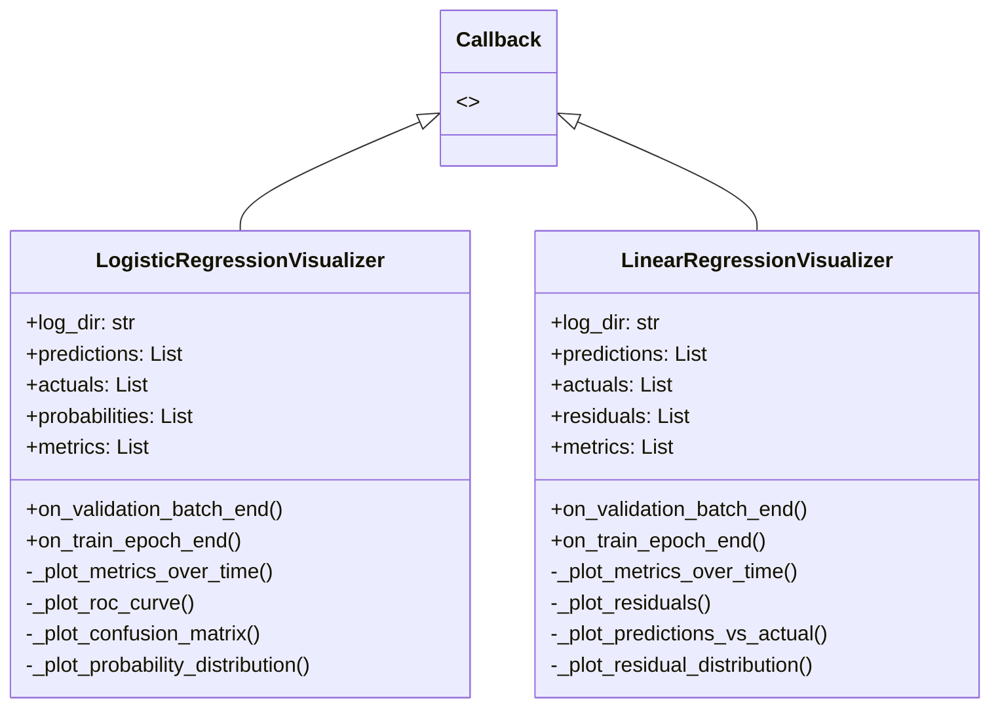

## Data Flow
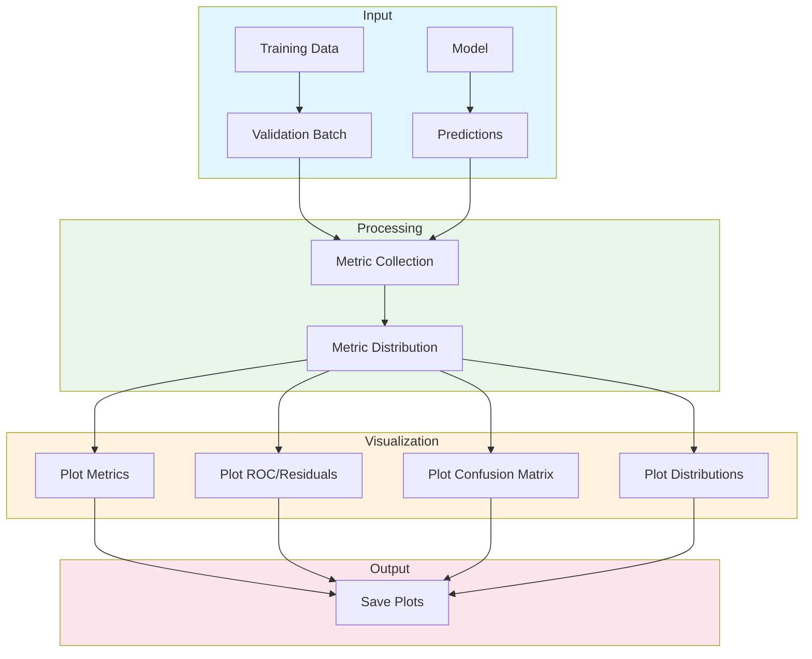

## Components

### 1. LogisticRegressionVisualizer

#### Purpose {id="purpose_1"}
Provides visualization capabilities for binary classification models.

#### Metrics Tracked {id="metrics-tracked_1"}
- Accuracy
- Precision
- Recall
- Training/Validation Loss
- Probabilities
- Predictions

#### Visualizations Generated {id="visualizations-generated_1"}
```python
def _plot_metrics_over_time(self):
    """Time series plot of classification metrics"""
    # Generates: metrics_over_time.png
```

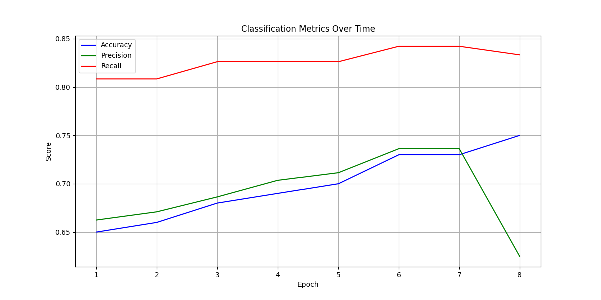

```python
def _plot_roc_curve(self):
    """ROC curve with AUC score"""
    # Generates: roc_curve.png
```

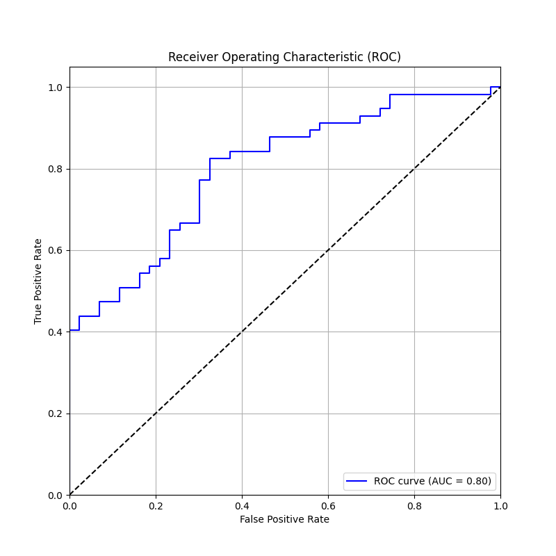

```python
def _plot_confusion_matrix(self):
    """Confusion matrix heatmap"""
    # Generates: confusion_matrix.png
```

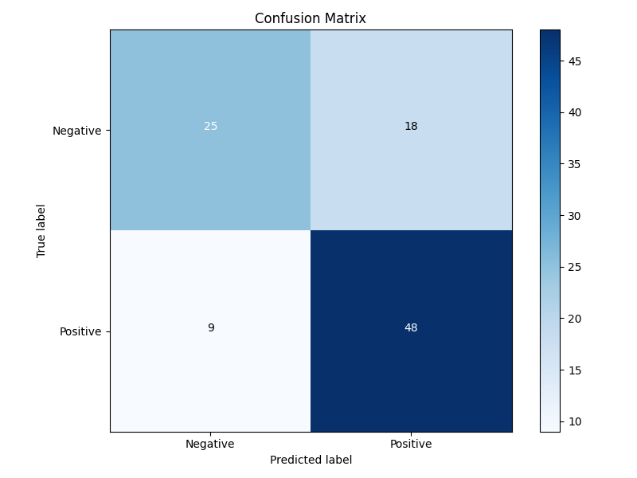

```python
def _plot_probability_distribution(self):
    """Distribution of predicted probabilities"""
    # Generates: probability_distribution.png
```
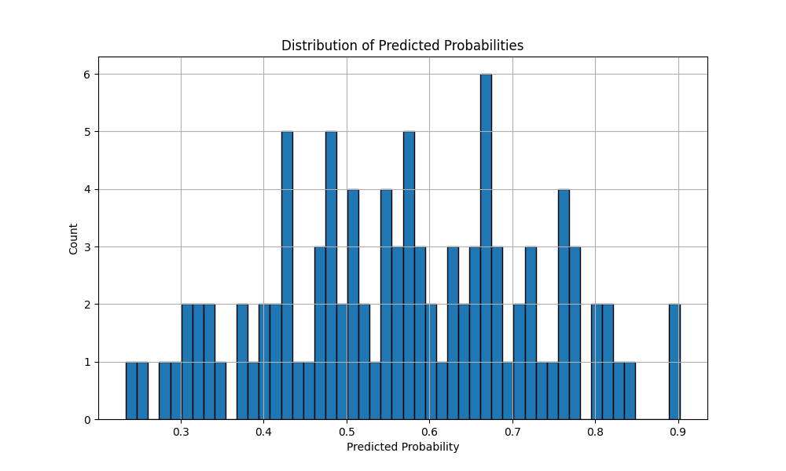

### 2. LinearRegressionVisualizer

#### Purpose
Provides visualization capabilities for regression models.

#### Metrics Tracked
- MSE
- R² Score
- Training/Validation Loss
- Residuals
- Predictions vs. Actual

#### Visualizations Generated
```python
def _plot_metrics_over_time(self):
    """Time series plot of regression metrics"""
    # Generates: metrics_over_time.png
```

```python
def _plot_residuals(self):
    """Residual analysis plot"""
    # Generates: residuals.png
```

```python
def _plot_predictions_vs_actual(self):
    """Scatter plot of predictions vs actual values"""
    # Generates: predictions_vs_actual.png
```

## Usage

### Integration with Models
```python
class YourModel(pl.LightningModule):
    def configure_callbacks(self):
        if self.config['model']['type'] == 'logistic_regression':
            return [LogisticRegressionVisualizer()]
        else:
            return [LinearRegressionVisualizer()]
```

### Output Directory Structure
```
training_plots/
├── logistic_regression/
│   ├── metrics_over_time.png
│   ├── roc_curve.png
│   ├── confusion_matrix.png
│   └── probability_distribution.png
└── linear_regression/
    ├── metrics_over_time.png
    ├── residuals.png
    ├── predictions_vs_actual.png
    └── residual_distribution.png
```

## Implementation Details

### Metric Collection
```python
def on_validation_batch_end(self, trainer, pl_module, outputs, batch, batch_idx):
    """Collects predictions and actual values during validation"""
    with torch.no_grad():
        # Collection logic
```

### Plot Generation
```python
def on_train_epoch_end(self, trainer, pl_module):
    """Generates all plots at the end of each training epoch"""
    # Plot generation logic
```

## Best Practices

1. **Memory Management**
   - Clear collected data after plot generation
   - Use `torch.no_grad()` for predictions
   - Convert tensors to numpy arrays for plotting

2. **Plot Configuration**
   - Use consistent figure sizes
   - Include proper labels and titles
   - Use appropriate color schemes
   - Add grids for readability

3. **File Management**
   - Create directories if they don't exist
   - Use appropriate file names
   - Close plot figures after saving

## Error Handling
```python
def _plot_any_metric(self):
    try:
        # Plot generation code
    except Exception as e:
        print(f"Error generating plot: {str(e)}")
    finally:
        plt.close()
```

## Example Output Analysis

### Classification Metrics
- ROC curve shows model discrimination ability
- Confusion matrix shows prediction distribution
- Probability distribution shows model confidence

### Regression Metrics
- Residual plots show error patterns
- Predictions vs. actual show model accuracy
- R² score tracks explained variance

## Class Architecture Diagram Analysis

The class architecture diagram illustrates the modular and hierarchical structure of the AutoML Pipeline.
At its core is the `AutoML` class, which inherits from PyTorch Lightning's `LightningModule`,
providing a robust foundation for deep learning workflows.
This design showcases a clear separation of concerns through composition,
where each major functionality is encapsulated in its own component.

The primary components include `DataPipeline`, `Optimization`, `Training`, and `ModelArchitecture`,
each handling specific aspects of the machine learning process.
The `DataPipeline` manages data processing and loading,
implementing efficient data handling with features like automatic worker optimization and batch processing.
The `Optimization` component encapsulates training optimizations such as mixed precision training and device management,
ensuring efficient resource utilization.

The architecture employs two key callback classes: `VisualizationCallback` and `MetricsCallback`.
The `VisualizationCallback` is responsible for generating comprehensive training visualizations,
including loss curves, learning rate schedules, and prediction distributions.
The `MetricsCallback` handles detailed metric logging and epoch summaries,
providing clear insights into training progress.

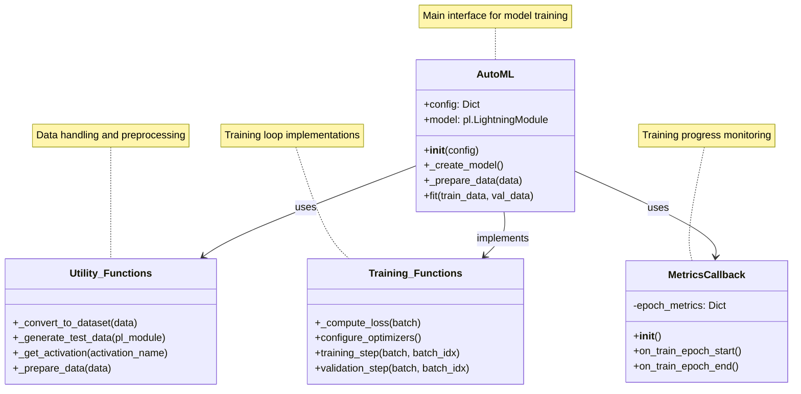

This architecture's strength lies in its modularity.
Each component can be enhanced or modified independently, making the system highly maintainable and extensible.
The clear hierarchical structure ensures that responsibilities are well-defined,
with the `AutoML`
class orchestrating the interactions between components while delegating specific tasks to specialized classes.

## Data Flow Diagram Analysis

The data flow diagram provides a comprehensive visualization of how data moves through the AutoML Pipeline system,
illustrating the complete machine learning workflow from raw data to final output.
The process is divided into distinct stages, each handling specific aspects of the machine learning pipeline.

The flow begins in the Input stage, where raw data and configuration settings enter the system.
The configuration defines the model architecture, training parameters, and optimization settings,
while the raw data moves through the Data Processing stage.
Here, the data is transformed into batches through the DataLoader system,
implementing efficient data loading strategies with optimized worker configurations.

The Training Loop stage represents the core of the system, where data flows through the model in a cyclical pattern.
Each batch moves through the forward pass, loss computation, and optimization steps,
with the system automatically handling device placement (CPU/GPU) and mixed precision training.
This stage is tightly integrated with the Monitoring & Visualization stage,
which continuously captures training metrics and generates various visualizations.

The Output stage shows the dual outcomes of the pipeline: the trained model and comprehensive training reports.
The reports include various visualizations like loss plots,
learning rate curves, confusion matrices, and class distributions,
providing deep insights into the model's performance and training dynamics.

This flow design emphasizes automation and efficiency,
with data moving seamlessly between stages while various optimization and monitoring processes occur automatically.
The system's ability to handle both the core training process
and generate detailed visualizations without manual intervention demonstrates its sophisticated automation capabilities.

Both diagrams together provide a complete picture of the AutoML Pipeline:
- The class architecture shows how the code is organized and structured
- The data flow diagram illustrates how data moves through this structure
- Together, they demonstrate how the system achieves its goal of automating machine learning workflows while maintaining flexibility and extensibility

The combination of modular architecture and streamlined data flow results in a system that is:
1. Easy to understand and modify
2. Efficient in operation
3. Comprehensive monitoring
4. Automated optimization
5. Flexible in application

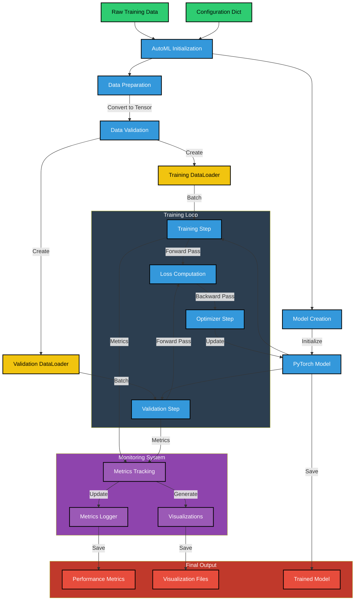

This architecture successfully balances complexity and usability,
providing powerful automation features while maintaining clarity and extensibility in its design.
